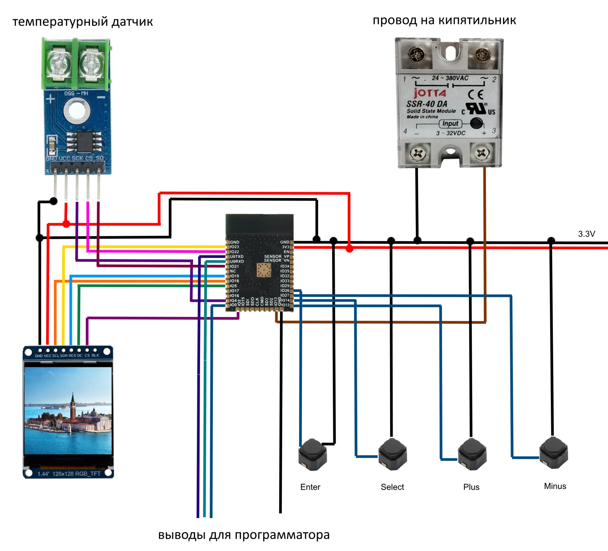

# Сушилка филамента
позволяет высушить пластик от влаги и сделать вашу 3D печать качественной.

## Используемые компоненты
* `ESP32` микроконтроллер. 
* `SSR-40 DA` твёрдотельное реле. 
* `MAX6675` температурный датчик. 
* `Buttons` любые 4 кнопки на выбор. 
* `1.44 128х128 TFT` дисплей ST7735. 
* `Компьютерный кулер 12 v` необходим для циркулирования горячего воздуха, что бы нагрев был равномерным. 
* `Кипятильник` подойдёт любой дешевый на 220 v. 
* `Корпус сушилки` можно использовать оцинкованное садовое ведро большого объема, либо придумать свой вариант из фанеры и тп.

## IDE
PlatformIO

## Используемые библиотеки
* `Adafruit GFX Library@^1.11.1` для дисплея. 
* `Adafruit ST7735 and ST7789 Library@^1.9.3` для дисплея. 
* `GyverMAX6675@^1.0` для температурного датчика. 
* `PWMrelay@^1.2` для управления реле. 
* `Adafruit BusIO@^1.11.6` это вспомогательная библиотека для абстрагирования транзакций и регистров I2C и SPI.. 

## Схема подключения:
